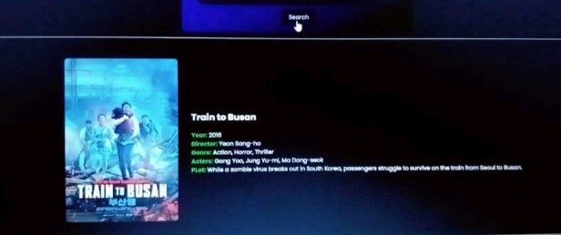

Movie Info App 

  

A simple and interactive web-based application to fetch and display detailed movie information using HTML, CSS, and JavaScript. The app allows users to search for movies by title and view essential details such as release year, cast, plot summary, and more.

Features
Search functionality: Easily search for movies by title.
Detailed movie info: View movie details including release date, actors, plot summary, ratings, and more.
Responsive design: Optimized for both desktop and mobile views.
External API integration: Fetches movie data using OMDb API, or a similar API.
User-friendly interface: Clean and intuitive design to enhance the user experience.
Demo
You can view the live demo of the Movie Info App [here](URL to live demo, if applicable).

Technologies Used
HTML: Structure and layout of the application.
CSS: Styling and design for the user interface.
JavaScript: Handling user input, fetching data from the API, and dynamically updating the UI.
OMDb API (or other movie API): To retrieve movie information.
How to Use
Search for a Movie: Type the name of the movie in the search bar.
View Movie Details: After pressing Enter or clicking the search button, the app will fetch movie details and display them below the search bar.
Explore Movie Info: Check out information like the plot, cast, director, release year, ratings, and more.
Installation
To run the project locally:

Clone the repository:

bash
Copy
git clone https://github.com/your-username/movie-info-app.git
Navigate to the project directory:

cd movie-info-app
Open index.html in your preferred browser.

No additional setup or installation is required. The project is entirely client-side and uses the OMDb API to fetch movie data.

Usage
Example Search:
Movie Title: "Inception"
Result: Displays movie details such as:
Release Year: 2010
Cast: Leonardo DiCaprio, Joseph Gordon-Levitt, Ellen Page
Plot: A thief who steals corporate secrets through the use of dream-sharing technology is given the inverse task of planting an idea into the mind of a CEO.
Ratings: 8.8/10
API Key Setup (Optional)
If you're using a custom API or the OMDb API, you may need to get your own API key:

Go to OMDb API and sign up for a free API key.

Once you have your API key, add it to the JavaScript code in the script.js file (or wherever the API request is made):

const apiKey = 'YOUR_API_KEY_HERE';
Save the changes and you should be able to make API requests.

Contributing
Fork the repository.
Create a new branch (git checkout -b feature-xyz).
Make your changes and commit (git commit -am 'Add new feature').
Push to the branch (git push origin feature-xyz).
Open a pull request.
License
This project is licensed under the MIT License - see the LICENSE file for details.

Acknowledgments
OMDb API for providing movie data.
Inspiration from various movie databases and web apps.

         
